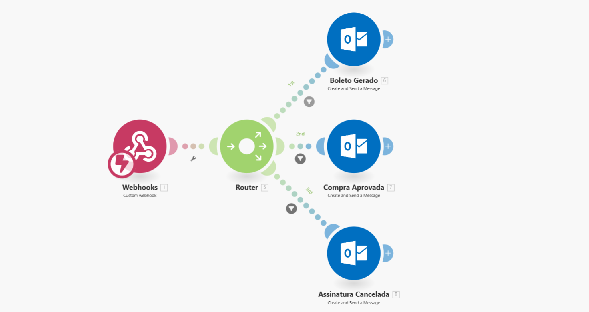
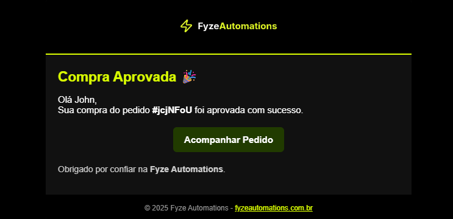
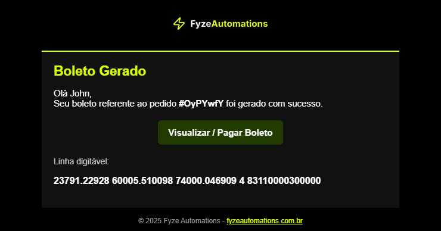
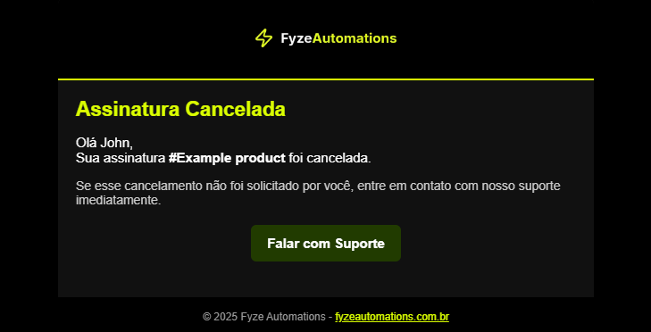

##### **📌 Projeto: Automação de E-mails Personalizados via Webhooks**

Este projeto demonstra como utilizar **plataformas de automação no-cod**e (ex.: Make) para criar fluxos que recebem eventos de plataformas de vendas (como **Kiwify** e **Hotmart**) e enviam **e-mails personalizados** via Outlook.

###### **⚙️ Estrutura do Fluxo**

1. Webhook → Captura eventos disparados pela plataforma de vendas.
2. Router (Make) → Direciona cada evento para o caminho correto.
3. Outlook → Envia o e-mail correspondente para o cliente.

###### **📧 Exemplos de Eventos Configurados**

* **Compra Aprovada** → Envia e-mail de boas-vindas.
* **Boleto Gerado** → Envia e-mail de lembrete de pagamento.
* **Assinatura Cancelada** → Envia e-mail de retenção.

*Observação: É possível adicionar diversos outros eventos disponíveis nas plataformas de vendas.*

###### **🖼️ Fluxo Visual**

###### 🖼️ **Exemplos de E-mails Personalizado**s

* E-mail de **Compra Aprovada**
* E-mail de **Boleto Gerado**
* E-mail de **Assinatura Cancelada**

###### **🚀 Benefícios da Automação**

* **Identidade da marca** → e-mails deixam de ser genéricos e passam a ter a cara da sua empresa.
* **Aumento de conversão** → lembretes e mensagens personalizadas impactam mais os clientes.
* **Retenção** → maior chance de manter assinantes ativos.

###### **🛠️ Tecnologias utilizadas**

* **Make** – para automação no-code
* **Outlook** – envio de e-mails automatizados
* **Webhook** – integração com eventos de plataformas de vendas

📌 **Status**: Projeto em prototipagem e testes práticos.

📌 **Parte da iniciativa**: ***Fyze Automations***<i> – soluções de automação para negócios digitais.</i>

